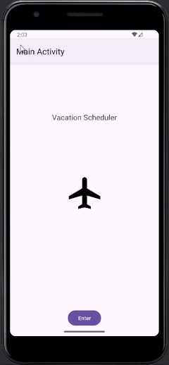
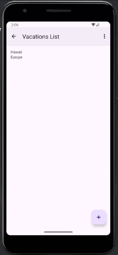
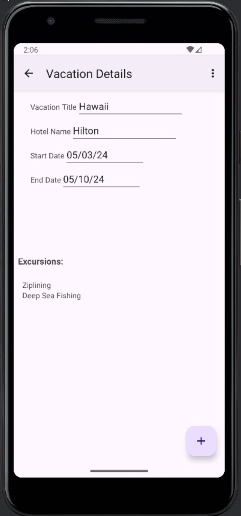

# Vacation Scheduler Application

## Purpose

The Vacation Scheduler Application is designed to help users plan and manage their vacations efficiently. The application allows users to schedule vacations and excursions, view vacation details, and receive notifications about their upcoming trips.

I created this app for the D308 Mobile Application Development (Android) course while attending the Software Engineering program at WGU.

## Navigating the Application

1. **Home Screen:**
    - Click the "Enter" button to enter the app.

2. **Vacations List:**
    - View a list of upcoming vacations.
  
3. **Adding a Vacation:**
    - From the vacations list screen, click on the "+" button.
    - Fill in the vacation details and use the menu option to save.

4. **Viewing Vacation Details:**
    - Click on a vacation from the vacations list to view detailed information.
    - Edit or delete the vacation as needed.

5. **Scheduling an Excursion:**
    - From the vacation details screen, click on the "+" button.
    - Fill in the excursion details and save.

6. **Receiving Notifications:**
    - From either the vacation details screen or the excursion details screen, users can use the "Notify" menu option to receive a notification for the vacation or excursion.

## Deployment

The signed APK is deployed to Android version 26 and above. It targets Android version 34.

## Images

